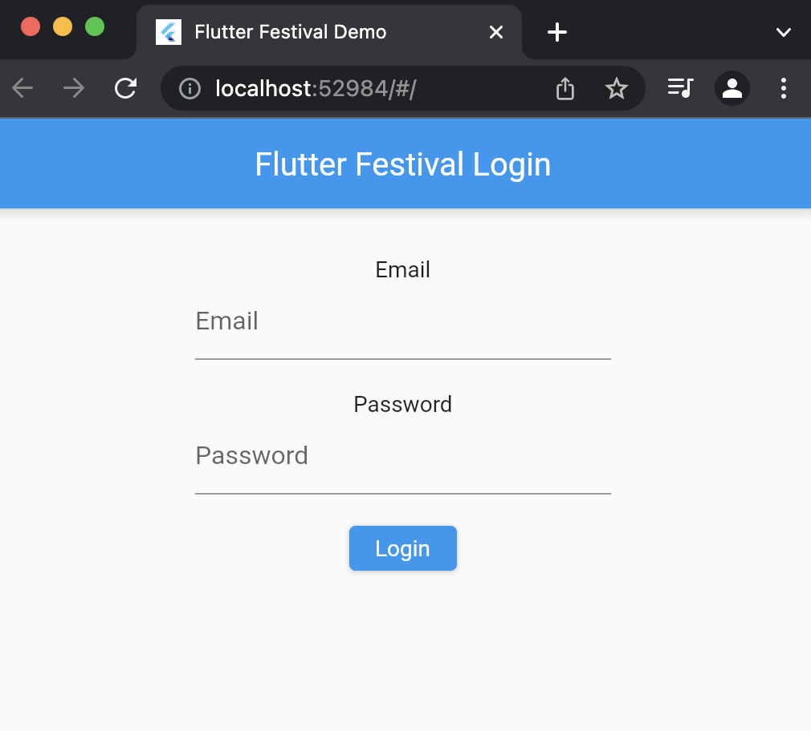

# Flutter Web & Firebase Authentication with Email and Password!

[][somnio_software_link]

Developed with :blue_heart: &nbsp;by [Somnio Software][somnio_software_link]

This repository contains an opinionated example on how to integrate Firebase Web Authentication using Email & Passowrd in your Flutter Web project!
We also make use of the BLoC pattern and some best practices.

[//]: # "Links"
[somnio_software_link]: https://somniosoftware.com/


#### Create the project

```
# Include fvm (optional)
# We will be using only web
fvm flutter create --project-name webapp --org com.somnio --platforms web
```

#### VS Code configuration

Add your launch.json in vscode

```
{
    "version": "0.2.0",
    "configurations": [
        {
            "name": "Web",
            "request": "launch",
            "type": "dart",
            "deviceId": "chrome",
            "program": "lib/main.dart",
        },
    ]
}
```

### 1- UI & State Management

Let's start with creating the required UI. It should look like this:



#### Add dependencies
```
flutter_bloc
equatable
firebase_core
firebase_auth
```

#### Mason

```
# download mason
dart pub global activate mason_cli
# verify mason is installed
mason --version
# init
mason init
# get all bricks registered
mason get
# check for install bricks
mason ls
```

#### Add feature_route_bloc brick

```
mason add -g feature_route_bloc \
--git-url https://github.com/gianfrancopapa/bricks \
--git-path bricks/feature_route_bloc
```

Let's create our Login feature!

### 2- Authentication Repository

#### Add flutter_package brick
```
mason add -g flutter_package \
--git-url https://github.com/gianfrancopapa/bricks \
--git-path bricks/flutter_package
```

#### Add dependencies
```
firebase_auth
firebase_auth_web
```

#### Firebase Cli

```
# https://firebase.google.com/docs/cli
curl -sL https://firebase.tools | upgrade=true bash
```

#### FlutterFire Cli

```
# install
dart pub global activate flutterfire_cli
# config
flutterfire config
```